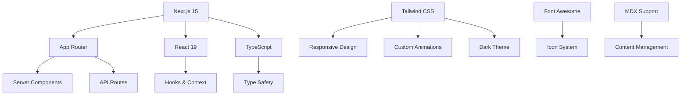

# 🚀 Likecat - Personal Portfolio

<div align="center">

> _"Building bridges between engineering and human needs, one line of code at a time."_

[](https://nextjs.org/)
[](https://www.typescriptlang.org/)
[](https://tailwindcss.com/)
[](https://opensource.org/licenses/MIT)

_A modern, responsive personal website showcasing research, projects, and technical expertise._

</div>

## 🌟 About Me

<div align="center">

**Bojun Zhang (Likecat)** | PhD Candidate in Mechanical Engineering | Xi'an Jiaotong University

</div>

I'm passionate about creating impactful solutions at the intersection of **artificial intelligence**, **human factors engineering**, and **medical technology**. My research focuses on bridging engineering principles with human-centered design to solve real-world challenges.

### 🔬 Research Focus Areas

| Domain                                 | Expertise                                   | Applications                            |
| -------------------------------------- | ------------------------------------------- | --------------------------------------- |
| 🤖 **AI Applications**                 | Visual saliency models, AI algorithms       | AI-driven analysis and optimization     |
| 👥 **Human Factors Engineering**       | Eye tracking, workload assessment           | Situational awareness, ergonomic design |
| 🏥 **Medical-Engineering Integration** | Medical device design, usability evaluation | Healthcare technology innovation        |
| 💻 **Human-Computer Interaction**      | Desktop apps, mobile interfaces             | 3D game UI, interactive systems         |

## 🛠️ Technical Architecture

### Core Technologies



### Key Features

- ⚡ **Next.js 15** with App Router for optimal performance
- 🎨 **Tailwind CSS** with custom gradients and animations
- 📱 **Mobile-first** responsive design
- 🌙 **Dark theme** with cyan accent colors
- ✨ **Smooth animations** and micro-interactions
- 🔍 **SEO optimized** with proper meta tags
- 🚀 **Fast loading** with optimized assets

## 🚀 Quick Start

### Prerequisites

- Node.js 18+
- npm, yarn, or pnpm

### Installation & Development

```bash
# Clone the repository
git clone https://github.com/alikecat/likecat.cn-next.js.git
cd likecat.cn-next.js

# Install dependencies
npm install

# Start development server
npm run dev
```

Visit [http://localhost:3000](http://localhost:3000) to see your site in action!

### Build for Production

```bash
# Build the application
npm run build

# Start production server
npm start
```

## 📁 Project Structure

```
likecat.cn-next.js/
├── app/                    # Next.js App Router
│   ├── about/              # About page with detailed bio
│   ├── components/         # Reusable React components
│   │   ├── Badges.tsx      # Skill badges component
│   │   ├── Card.tsx        # Card layout component
│   │   ├── Effects.tsx     # Visual effects
│   │   ├── FootBar.tsx     # Footer component
│   │   ├── NavBar.tsx      # Navigation component
│   │   ├── SideBar.tsx     # Sidebar navigation
│   │   └── Typewriter.tsx  # Typewriter animation
│   ├── globals.css         # Global styles and Tailwind config
│   ├── layout.tsx          # Root layout component
│   └── page.tsx           # Homepage component
├── public/                 # Static assets
│   ├── Display.jpg         # Professional portrait
│   ├── Profile.jpg         # Profile photo
│   └── Design_UI.jpg       # UI design showcase
├── next.config.mjs         # Next.js configuration
├── tailwind.config.js      # Tailwind CSS configuration
└── tsconfig.json          # TypeScript configuration
```

## 🎯 Development Philosophy

> _"As a researcher, I believe our digital presence should reflect the same precision and thoughtfulness we apply to our academic work."_

This website embodies several core principles:

### 🔍 Attention to Detail

Every component is crafted with maintainability and performance in mind, reflecting the meticulous approach I bring to research.

### 🎨 Design Excellence

Inspired by scientific precision meeting artistic expression, creating visually appealing yet functional interfaces.

### 💡 Continuous Innovation

A technical playground for experimenting with modern web technologies and design patterns.

## 🌐 Connect With Me

I'm always excited to discuss research collaborations, technical challenges, or innovative projects!

<div align="center">

[](mailto:a@likecat.cn)
[](https://github.com/alikecat)
[](https://orcid.org/0000-0002-1867-0243)

</div>

## 📊 Project Stats

<div align="center">


</div>

---

<div align="center">

### 🛠️ Built With Passion

_Built with ❤️ and lots of ☕ using Next.js, TypeScript, and Tailwind CSS_  
_"Code is poetry, and every project is a story waiting to be told."_

⭐ **Star this repository if you find it inspiring!**

</div>